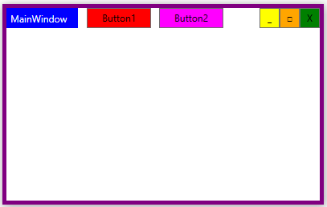

# WPF custom frame example using WM_NCCALCSIZE and WM_NCHITTEST

WPF provides WindowChrome class to remove standard Windows non-client area and provide custom border and title. Unfortunately, removing all non-client edges with WindowChrome results in some ugly flickering on window resize. To solve this problem, you can handle WM_NCCALCSIZE and WM_NCHITTEST messages to remove standard non-client area and process mouse clicks so your window can be moved and resized using your custom frame. This enables you to remove all edges without flickering. (This example is designed for Windows 10 standard theme, so we remove only the top edge, because others are "invisible" anyway.)

Based on [Custom Window Frame Using DWM](https://docs.microsoft.com/en-us/windows/win32/dwm/customframe) Microsoft Docs example.
